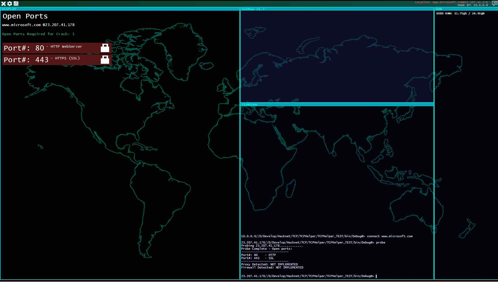
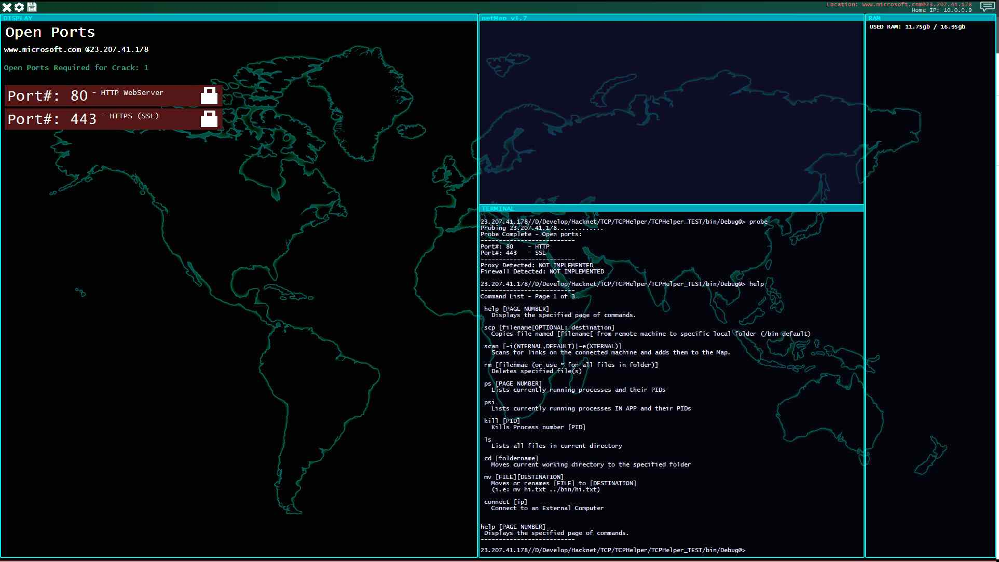

# Hacknet
A conversion of the game "Hacknet" to an actual working client. 

I loved the game Hacknet so much, I started wondering - could I create a client that actually worked like the game itself?

I started this project as a proof of concept in C#. In it's current state, it has the base organization in place, help which prints out a list of the basic commands available - almost the same exact list that's in the video game this was modelled after, with a few extensions here and there. 

Some commands are currently functional - port scans for instance are quick and work, this client just doesn't actually implement the hacks (yet). I also added in a command to retrieve wireless access points, and a few others. 

Again, the only reason I'm posting this to GITHUB is I've gotten bored of it, and wouldn't mind seeing others branch this and work on it themselves. 

Please, let me know if you find value with this!

Screenshot of an actual probe (against www.microsoft.com)

Screenshot of a help request.

